# AWS Web Application

## Project Goal:
This project aims to design and deploy a reliable web application infrastructure on AWS for the company, SmartShop. In developing the solution to meet SmartShop's requirements, some AWS services such as EC2, Virtual Private Cloud (VPC), Identity and Access Management (IAM), Security Groups, etc were used.

## Technologies used:
 - AWS Amazon console
 - GitHub
 - Git Bash
 - Apache Server
 - Web Browser ( Chrome)

## Steps involved in designing and deployment of Web Application Infrastructure:
   Before launching an EC2 instance, you will need to set up your VPC, Subnets, Internet Gateway where you also are able to configure the Route Table, Network Access Control List (NACL).

### 1. Creation of a VPC
- In the AWS Console, the very first thing is to select the region you want to work in, this would determine where all your resources would be both created and deployed. The region I chose for this project was **'N. Virginia us-east-1'**
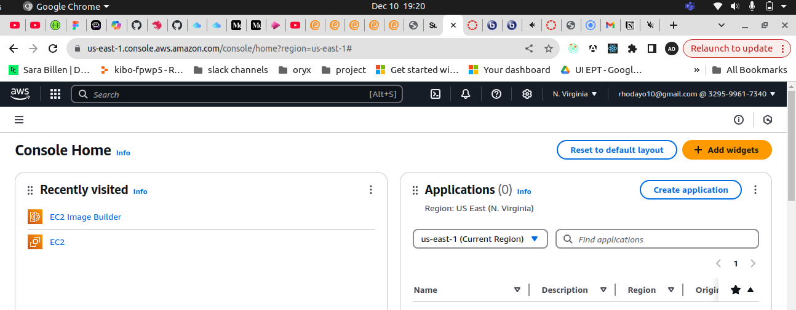

- In your AWS Console, search for VPC,and select the option from the dropdown with Isolated Cloud Resources.
- Select the 'Create VPC' button.
- Name the VPC, In this project, IPv4 CIDR block (e.g., 10.0.0.0/16) was chosen, and click Create.
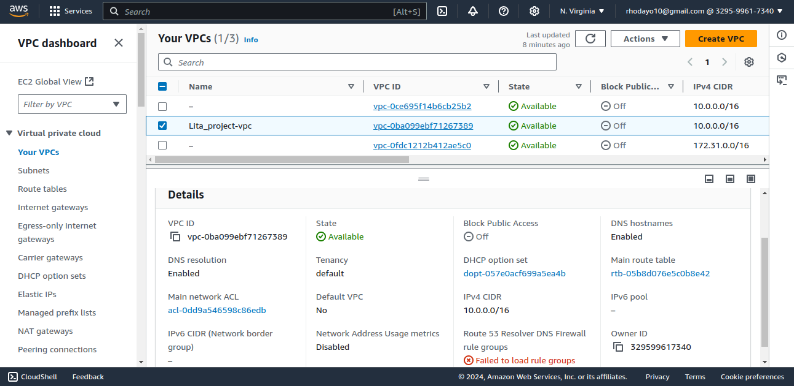

### 2. Creation of Subnets
   To access this feature, you can either search for 'Subnet' on the Search bar or still in the VPC Window, Subnets are part of the resources to be setup under the region.
- Create Subnet by clicking the orange button with text 'Create Subnet', Select your VPC and create the subnets required, for this project, two subnets were created: Public Subnet: CIDR- 10.0.1.0/24 and Private Subnet: CIDR- 10.0.2.0/24
- A good practice would be to name them clearly for easy identification.

Public Subnet:
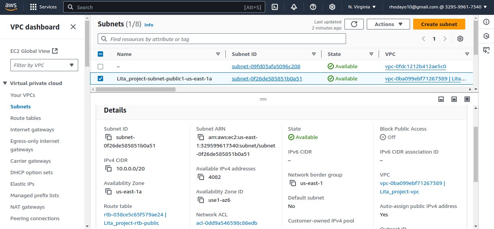

Private Subnet:
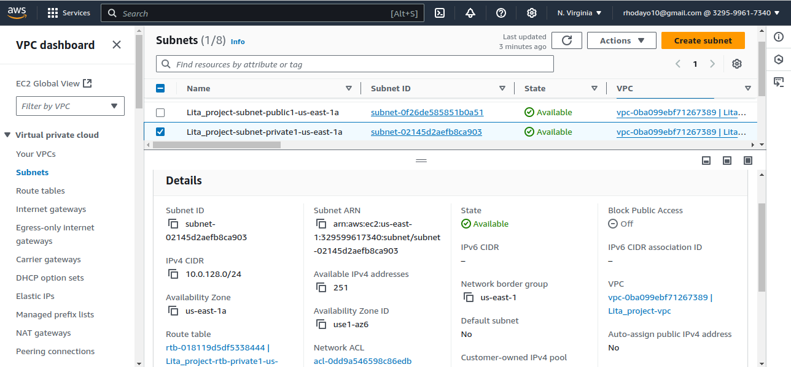

### 3. Internet Gateway
 - On the VPC feature, select **Internet Gateways**, click 'Create internet gateway.', attach the gateway to the VPC created initially.
 - Go to Route Tables, create a new route table, and associate it with the public subnet, and add a route. For this project, these were the values used for Destination and Target:
   ▪ Destination: 0.0.0.0/0
   ▪ Target: Internet Gateway

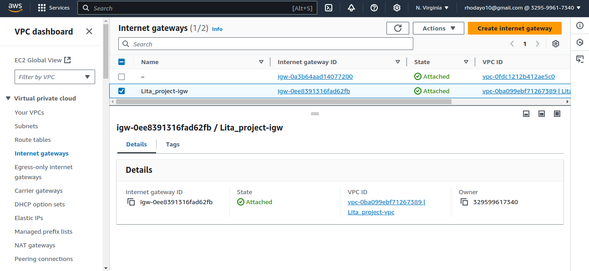

### 4. Configure Network Access Control List (NACL)
- On the search bar, search for NACL, Create a new NACL.
- This NACL should be attached to the previously private and public subnets created.
- The inbound and outbound rules need to also be defined to control the incoming or outgoing traffic that is allowed to reach or leave the VPC.
- In this project, we **Allow HTTP (80) and SSH (22)**.

  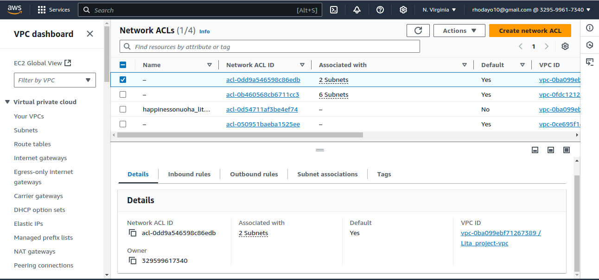

  Attached Subnets to NACLs:
  
  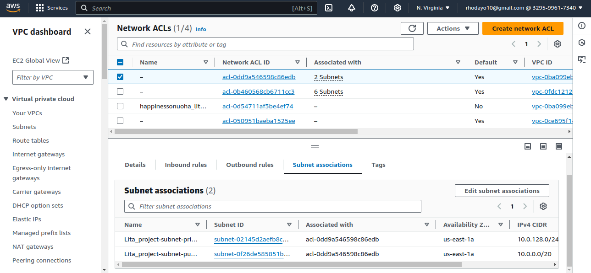

### 5. Set Up Security Groups
- Navigate to Security Groups and create a new group.
- For this project, we Allow inbound HTTP (port 80) from anywhere and SSH (port 22) access from
your IP for the web and admin access.
- Finally, attach this Security Group to your EC2 instances.
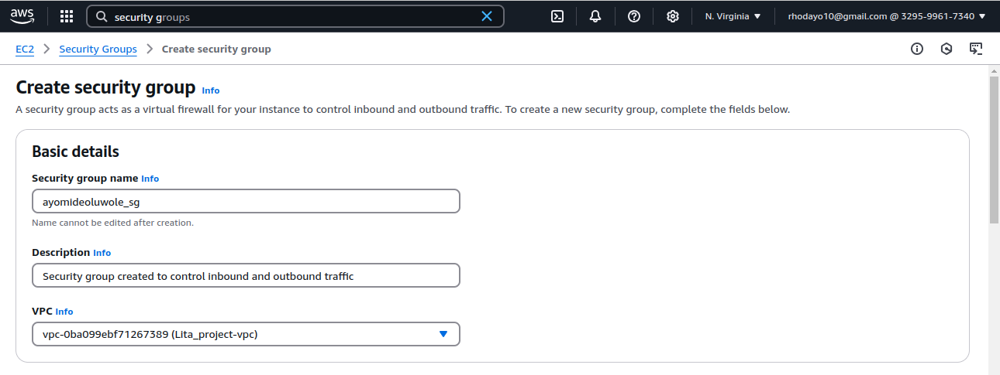

Successful Security Group:
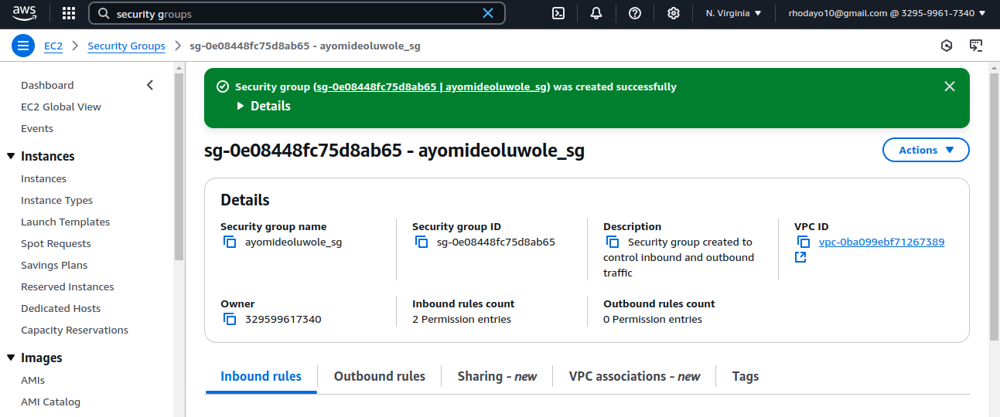

Inbound rule for SG:
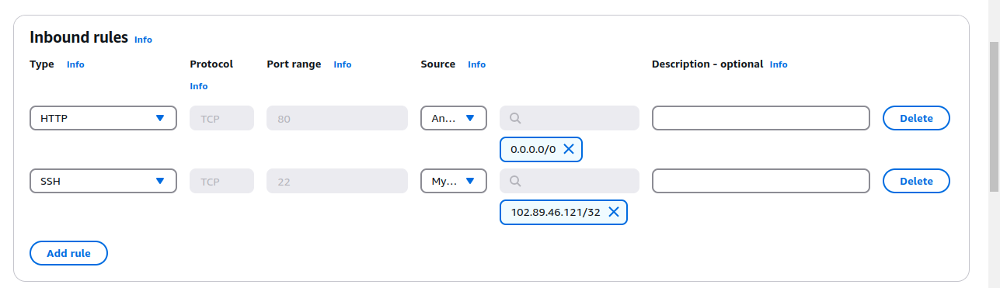

### 6. Launch an EC2 Instance with Apache Web Server
- To launch an EC2 Instance, search for 'EC2' in the search console and in the EC2 Dashboard, click **Launch Instance**.

  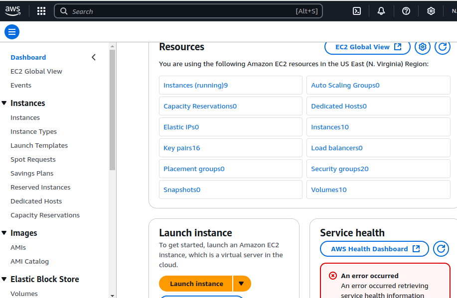
  
- Rename your instance (optionally) e.g “ayomideoluwole_lita”
- For this project, we made use of 'Amazon Linux 2' for the OS and the instance type as 't2.micro'.
- Configure the instance with the public subnet and assign the Security Group created initially.
  
  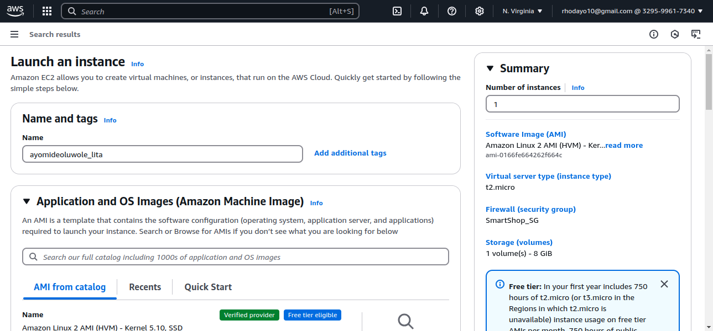
  
  Another important aspect of launching an EC2 instance is creating a Key Pair. This is done by:
- Click the 'Generate Key Pair'.
- Provide a name for your key pair (e.g., SMartShop_KPs).
- Choose the Key Pair Type: RSA (default).
- Click Create Key Pair.
  The private key file (.pem ) will be downloaded automatically to your computer. This is to be stored securely as it can only be downloaded once!

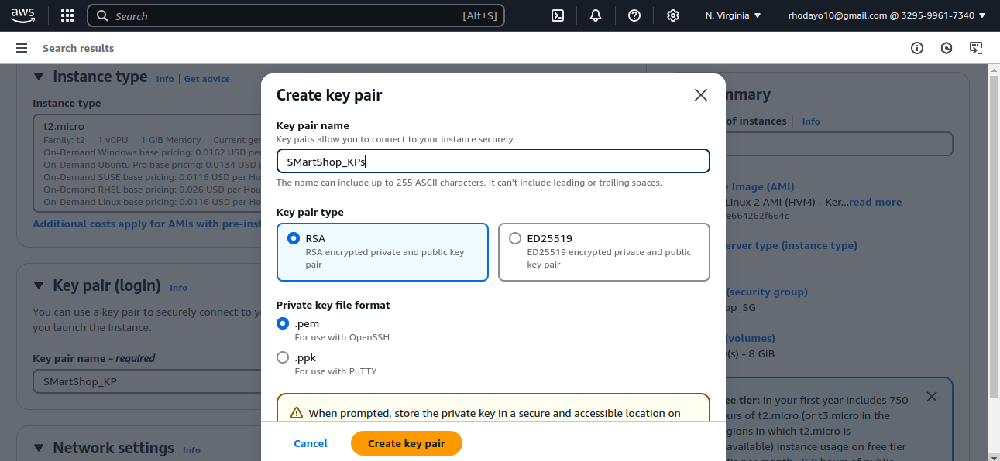

 The next category to look into is the “Network settings” Click the “Edit” button.
 - Select the VPC earlier created.
 - Select the Public Subnet created initially.
 - Make sure the “Auto-assign Public IP” is set to “Enabled”
 - Select security group earlier created
 - For this project, the “Configure storage” was set at 8gb

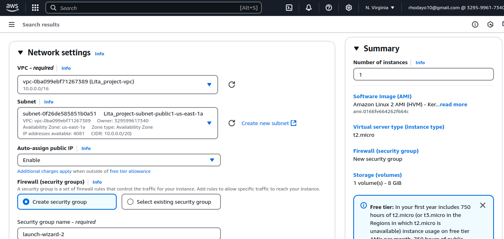
   
 - Review your configuration summary and the click the “Launch Instance”.
 - Your instance is ready when you see “2/2 check passed” (it might take a few minutes)

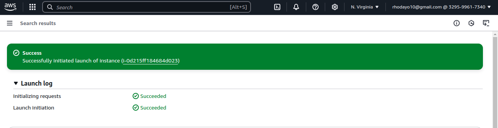
